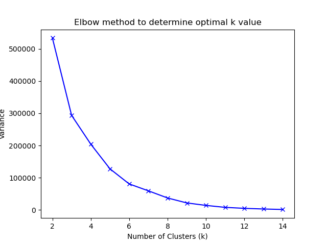
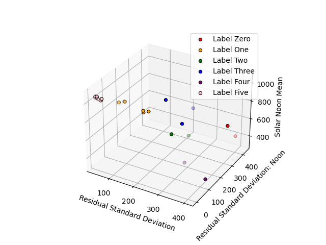

# Plots

Example plots showing classification scheme.

## Elbow Method
This allows us to determine the correct amount of clusters to use.

## Classification Scheme
We classify the weather by comparing TSI measurements to a TSI model for 

## Example Class Labeling

Dates are labeled into one of six classes, class zero being the best weather,
class one usable if needed, and classes two to five as unusable.

